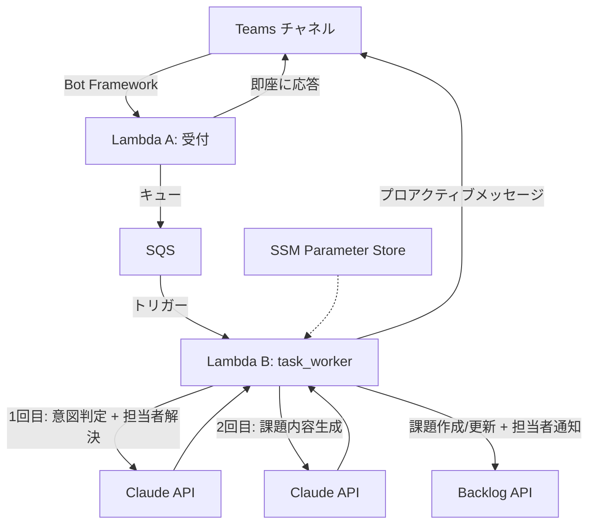
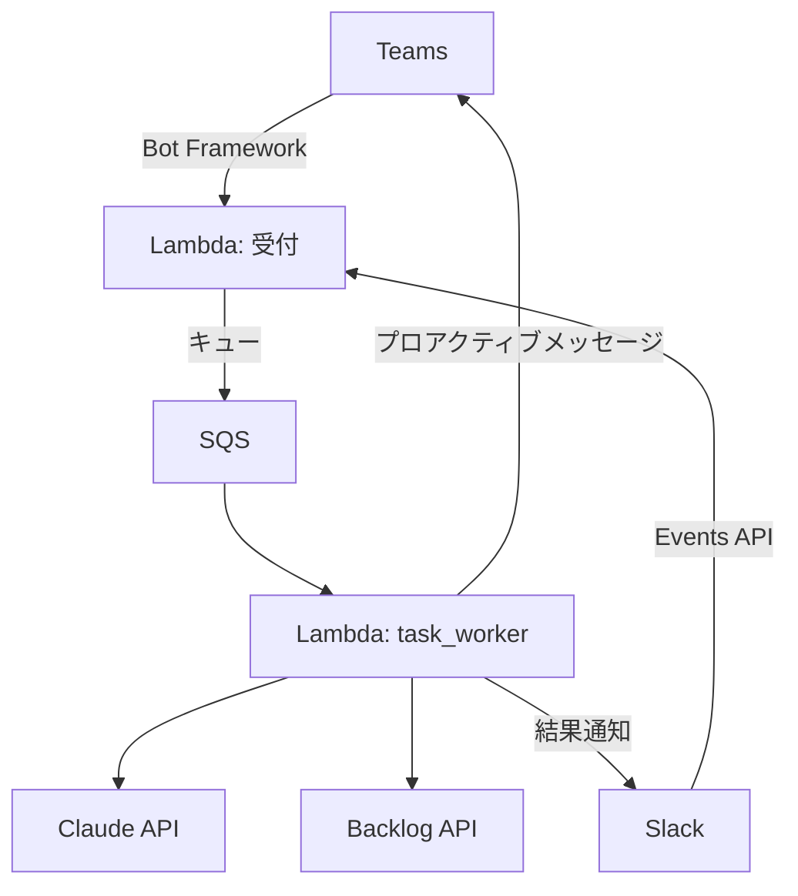
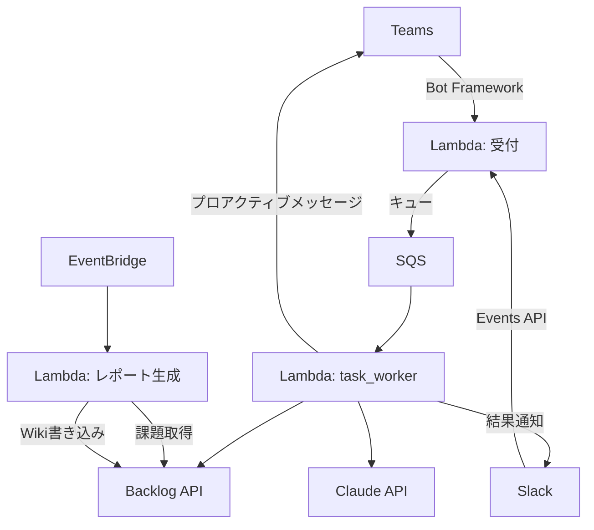
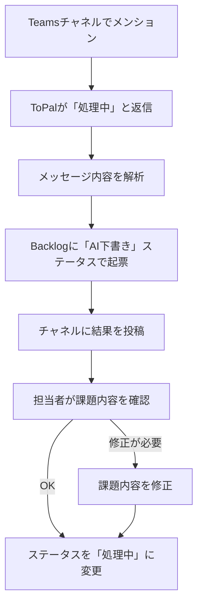
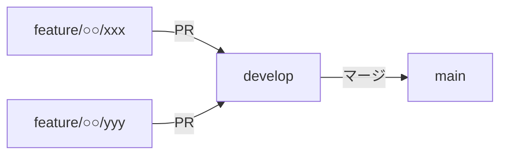

# ToPal（トパル）

チームの「頼れる相棒」— Teams のメッセージをチェックして、Backlog のタスクを自動で整理・作成。
期限や優先度も意識して、チームの作業漏れやミスを防ぎます。

## 課題（Before）
- BacklogやGitHub Issueへの起票が手動で、漏れや遅れが発生
- Teams上のやり取りからタスクが拾いきれない
- 進捗状況の把握が属人化し、見える化が不十分

## 解決（目的）
- Teams → タスク/Issue自動起票で起票漏れを防止
- 日次の進捗レポート自動生成でプロジェクトを見える化
- 管理負荷を軽減し、本来の業務に集中できる環境を作る

## アーキテクチャ

### フェーズ1: Teams連携・タスク自動起票



```
処理の流れ:
1. ユーザーが Teams で @ToPal をメンション
2. Lambda A が JWT検証 → SQS にキュー → 「処理中です...」を即返却
3. Lambda B が SQS から取得 → Claude API 2回呼び出し → Backlog に起票
4. 結果を Bot Framework プロアクティブメッセージで Teams チャネルに投稿
```

### フェーズ2: Slack連携



### フェーズ3: 日次レポート（個別ジョブ）追加



## 機能

| 機能 | 概要 | フェーズ |
|---|---|---|
| **タスク自動起票** | TeamsのメッセージからBacklog課題を自動作成 | 1 |
| **優先度・期限判定** | メッセージ内容から優先度や期限を自動判定 | 1 |
| **担当者あいまい検索** | 日本語/ローマ字/姓のみ等の揺れをClaude APIが吸収して担当者を解決 | 1 |
| **担当者通知** | タスク作成・更新時にBacklog上で担当者に通知 | 1 |
| **Slack連携** | Slackからのメッセージ受信・タスク自動起票 | 2（後回し） |
| **進捗レポート** | 日次で進捗サマリーをBacklog Wikiに自動生成（個別ジョブ） | 3（後回し） |

## 利用方法

Teams のチャネルで ToPal をメンションして呼び出す。

```
@ToPal [NOHARATEST] この件、課題にしておいて。田中さん担当で2時間くらい
```

### 利用者から見た流れ

1. チャネルで `@ToPal` をメンション
2. ToPal が「処理中...」と返信
3. メッセージ内容を解析し、Backlogに課題を起票
4. 完了後、チャネルに結果を投稿

```
🔄 処理中です...しばらくお待ちください。
✅ 野原 太郎さんのリクエストでタスクを作成しました: NOHARATEST-1 ログイン機能を実装する。
```

## 運用フロー



- ToPalが起票する課題は**すべて「AI下書き」ステータス**で作成される
- 人が内容を確認してから「処理中」に変更することで、誤起票や内容ミスを防ぐ

## 技術スタック
- **AWS Lambda** - メッセージ受付・非同期処理
- **Amazon SQS** - 受付→ワーカー間の非同期キュー（DLQ付き）
- **AWS SSM Parameter Store** - APIキー・プロジェクト設定の管理
- **Claude API** - 意図判定（1回目）・課題内容生成（2回目）
- **Bot Framework** - Teams メッセージ受信（JWT認証）・結果通知（プロアクティブメッセージ）
- **Backlog API** - 課題CRUD・種別/ステータス/カテゴリ管理
- **Terraform** - インフラ管理（Lambda, API Gateway, SQS, IAM）
- **GitHub Actions** - CI/CD（テスト + デプロイ）

## ブランチ構成

### ブランチ戦略



- `main`: リリース可能な安定版のみ。developからのマージのみ受け付ける
- `develop`: 開発統合ブランチ。featureブランチはここにマージする
- `feature/*`: developから切って、完了後developにPRを出す

### 命名規則

```
feature/<担当者名>/<機能名>
```

例: `feature/nohara/teams-webhook`

## リポジトリの位置づけ
まずは空き時間で小さく作って検証するフェーズ。業務影響は出さない前提で進める。
