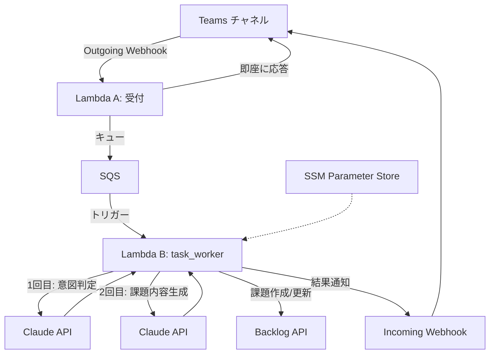
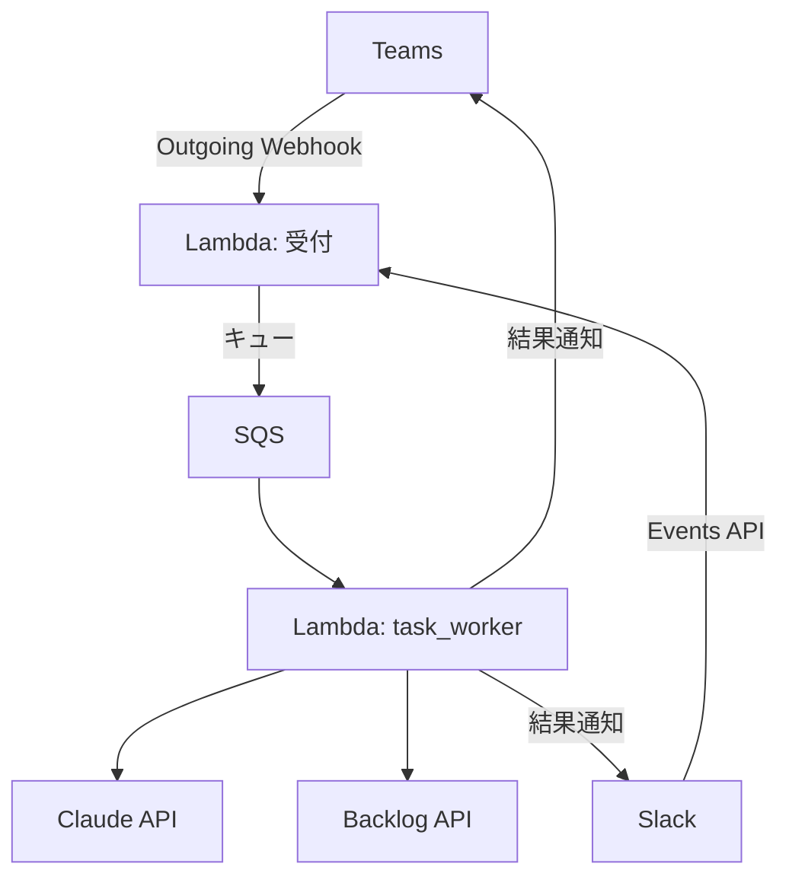
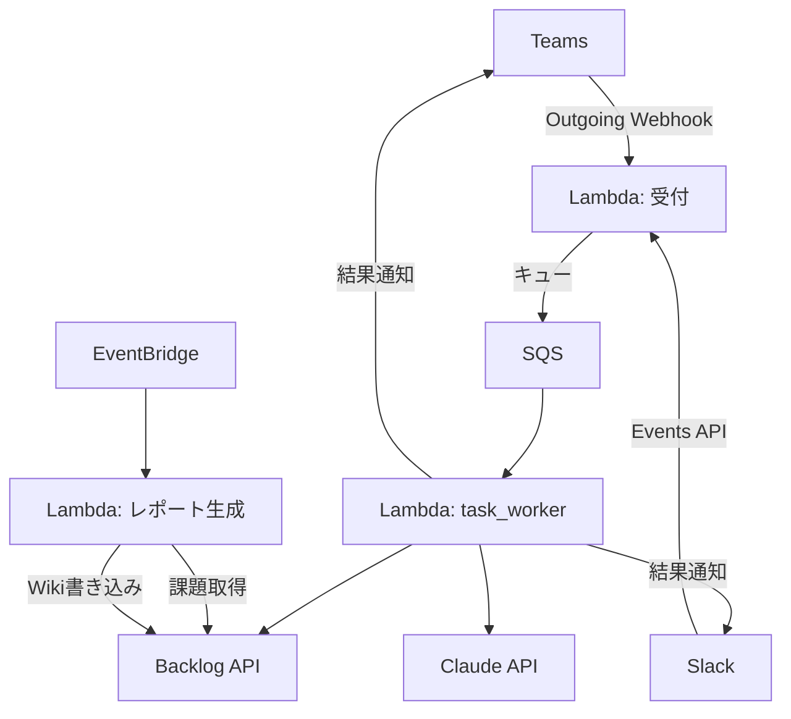
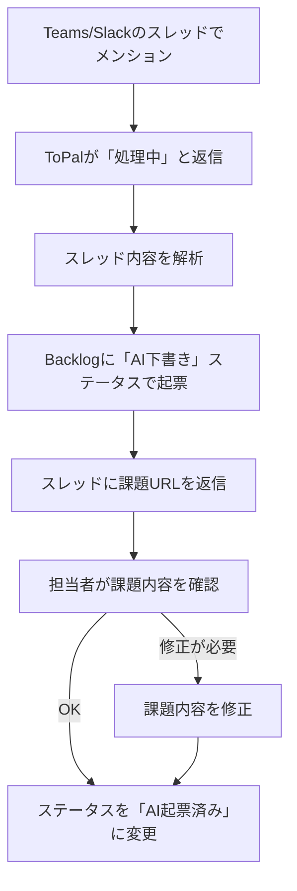
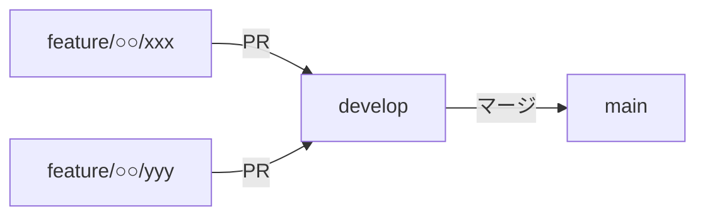

# ToPal（トパル）

チームの「頼れる相棒」— Slack/Teams のスレッドをチェックして、タスクを自動で整理・作成。
期限や優先度も意識して、チームの作業漏れやミスを防ぎます。

## 課題（Before）
- BacklogやGitHub Issueへの起票が手動で、漏れや遅れが発生
- Teams上のやり取りからタスクが拾いきれない
- 進捗状況の把握が属人化し、見える化が不十分

## 解決（目的）
- Teams → タスク/Issue自動起票で起票漏れを防止
- 日次の進捗レポート自動生成でプロジェクトを見える化
- 管理負荷を軽減し、本来の業務に集中できる環境を作る

## アーキテクチャ

### フェーズ1: Teams連携・タスク自動起票



```
処理の流れ:
1. ユーザーが Teams で @ToPal をメンション
2. Lambda A が HMAC検証 → SQS にキュー → 「処理中です...」を即返却（5秒以内）
3. Lambda B が SQS から取得 → Claude API 2回呼び出し → Backlog に起票
4. 結果を Incoming Webhook 経由で Teams チャネルに投稿
```

### フェーズ2: Slack連携



### フェーズ3: 日次レポート（個別ジョブ）追加



## 機能

| 機能 | 概要 | フェーズ |
|---|---|---|
| **タスク自動起票** | TeamsのメッセージからBacklog/GitHub Issueを自動作成 | 1 |
| **優先度・期限判定** | メッセージ内容から優先度や期限を自動判定 | 1 |
| **Slack連携** | Slackからのメッセージ受信・タスク自動起票 | 2（後回し） |
| **進捗レポート** | 日次で進捗サマリーをBacklog Wikiに自動生成（個別ジョブ） | 3（後回し） |

## 利用方法

Teams / Slack のスレッド内で ToPal をメンションして呼び出す。

```
@ToPal この件、課題にしておいて
```

### 利用者から見た流れ

1. スレッドで `@ToPal` をメンション
2. ToPal が「処理中...」と返信
3. スレッド内容を解析し、Backlogに課題を起票
4. 完了後、スレッドにBacklogの課題URLを返信

```
🔄 処理中...
✅ 起票しました: https://xxx.backlog.com/view/PROJ-123
```

## 運用フロー



- ToPalが起票する課題は**すべて「AI下書き」ステータス**で作成される
- 人が内容を確認してから「処理中」に変更することで、誤起票や内容ミスを防ぐ
- 下書きのまま放置された課題は日次レポート（フェーズ3）で検知予定

## 技術スタック
- **AWS Lambda** - メッセージ受付・非同期処理・レポート生成
- **Amazon SQS** - 受付→ワーカー間の非同期キュー（DLQ付き）
- **AWS SSM Parameter Store** - APIキー・プロジェクト設定の管理
- **Claude API** - 意図判定（1回目）・課題内容生成（2回目）
- **Amazon EventBridge** - 日次スケジュール実行（フェーズ3）
- **Microsoft Teams** - Outgoing Webhook（受信）/ Incoming Webhook（結果通知）
- **Slack** - Events API連携（フェーズ2）
- **Backlog API** - 課題CRUD・種別/ステータス/カテゴリ管理

## ブランチ構成

### ブランチ戦略



- `main`: リリース可能な安定版のみ。developからのマージのみ受け付ける
- `develop`: 開発統合ブランチ。featureブランチはここにマージする
- `feature/*`: developから切って、完了後developにPRを出す

### 命名規則

```
feature/<担当者名>/<機能名>
```

例: `feature/nohara/teams-webhook`

### ブランチ一覧

| ブランチ | 概要 | フェーズ |
|---|---|---|
| `main` | 安定版・リリース用 | - |
| `develop` | 開発統合ブランチ | - |
| `feature/○○/teams-webhook` | Teamsからのメッセージ受信（Webhook/Bot）基盤 | 1 |
| `feature/○○/task-create` | 受信メッセージからBacklog/GitHub Issueへの自動起票 | 1 |
| `feature/○○/infra` | AWS基盤（Lambda, EventBridge, Aurora等）のIaC | 1 |
| `feature/○○/slack-webhook` | Slackからのメッセージ受信（Webhook/Bot）基盤 | 2（後回し） |
| `feature/○○/daily-report` | 日次進捗レポートのBacklog Wiki自動生成（個別ジョブ） | 3（後回し） |

## フェーズ1 ワークフロー

詳細は [docs/phase1-workflow.md](docs/phase1-workflow.md) を参照。

## リポジトリの位置づけ
まずは空き時間で小さく作って検証するフェーズ。業務影響は出さない前提で進める。
