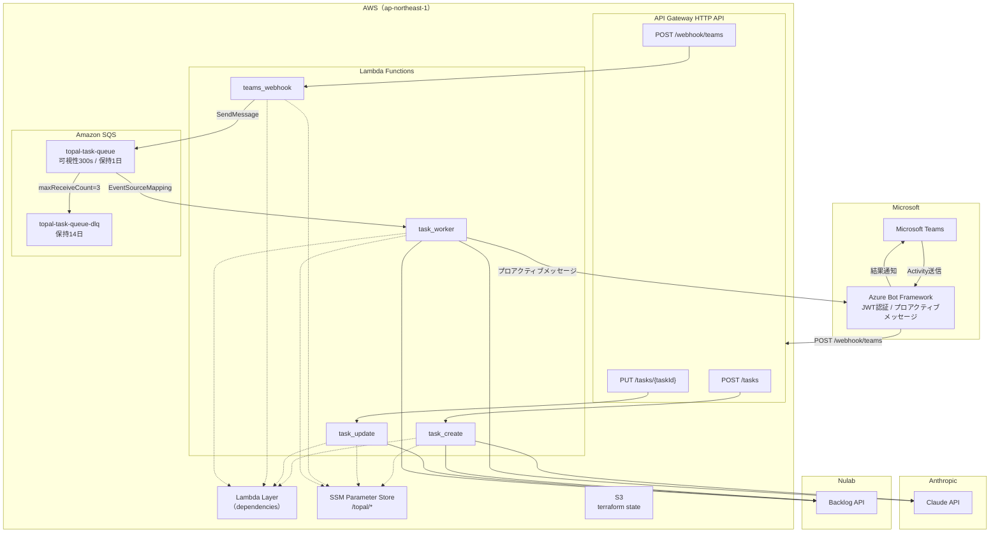

# AWSインフラ構成図

## リソース一覧

| サービス | リソース名 | 用途 |
|---------|-----------|------|
| API Gateway | topal-dev-api | HTTPルーティング（4エンドポイント） |
| Lambda | topal-dev-task-create | タスク新規作成 |
| Lambda | topal-dev-task-update | タスク更新 |
| Lambda | topal-dev-teams-webhook | Teams受付（JWT検証→SQSキュー→即応答） |
| Lambda | topal-dev-task-worker | 非同期処理（Claude API→Backlog→通知） |
| Lambda Layer | topal-dev-deps | Python依存パッケージ共有 |
| SQS | topal-task-queue | 受付→ワーカー間の非同期キュー |
| SQS | topal-task-queue-dlq | デッドレターキュー（3回失敗で移動） |
| SSM | /topal/* | APIキー・プロジェクト設定 |
| S3 | nct-topal-tfstate | Terraform state管理 |
