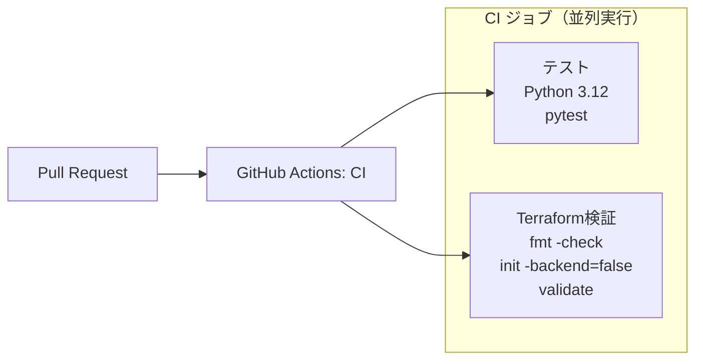
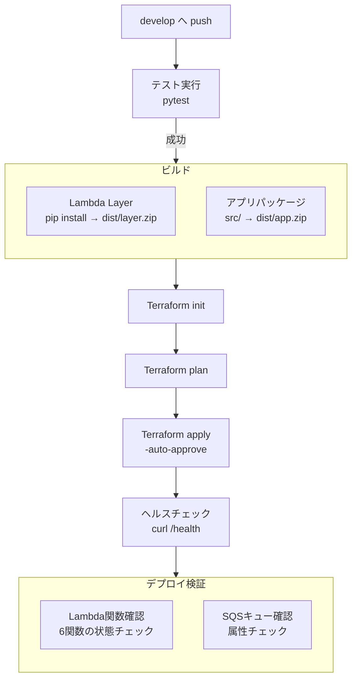
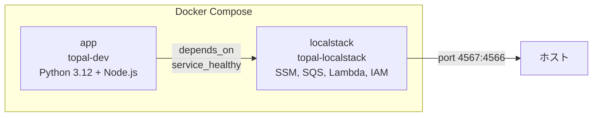

# デプロイ構成・デプロイフロー

## デプロイフロー

### CI（PR時）

PRが `develop` または `main` ブランチに向けて作成されると、テストとTerraform検証が並列実行される。



### CD（develop push時）

`develop` ブランチへのpushでデプロイが実行される。



## デプロイ構成

### ビルド成果物

| 成果物 | 内容 | 生成方法 |
|--------|------|----------|
| `dist/layer.zip` | Python依存パッケージ（Lambda Layer） | `pip install -r requirements.txt -t python/` → zip |
| `dist/app.zip` | アプリケーションコード（`src/`） | `zip -rq dist/app.zip src/` |

### Terraform

- **バックエンド**: S3（リモートステート管理）
- **適用方法**: `terraform apply -auto-approve`（CD時に自動適用）
- **バージョン**: 1.9.8
- **リージョン**: ap-northeast-1

### GitHub Secrets

| シークレット | 用途 |
|------------|------|
| `AWS_ACCESS_KEY_ID` | AWSアクセスキーID |
| `AWS_SECRET_ACCESS_KEY` | AWSシークレットアクセスキー |

### デプロイ対象Lambda関数

| 関数名 | 用途 |
|--------|------|
| `topal-dev-health` | ヘルスチェック |
| `topal-dev-task-create` | タスク作成 |
| `topal-dev-task-update` | タスク更新 |
| `topal-dev-teams-webhook` | Teams Webhook受信 |
| `topal-dev-task-worker` | SQSワーカー |

## ローカル開発環境

### Docker Compose構成



| サービス | コンテナ名 | 説明 |
|----------|-----------|------|
| `app` | `topal-dev` | 開発コンテナ（Python 3.12 + Claude Code CLI） |
| `localstack` | `topal-localstack` | AWSローカルエミュレータ（SSM, SQS, Lambda, IAM） |

### 起動

```bash
docker compose up -d
```

`app` コンテナは `localstack` のヘルスチェック完了後に起動する。

### LocalStack初期化

`localstack/init.sh` がコンテナ起動時に自動実行され、以下のリソースが作成される。

**SSMパラメータ:**

| パラメータ | 型 | 説明 |
|-----------|------|------|
| `/topal/anthropic_api_key` | SecureString | Claude APIキー |
| `/topal/claude_model` | String | 使用モデル |
| `/topal/microsoft_app_id` | String | Teams Bot アプリID |
| `/topal/microsoft_app_password` | SecureString | Teams Bot パスワード |
| `/topal/{PROJECT}/backlog_api_key` | SecureString | Backlog APIキー |
| `/topal/{PROJECT}/backlog_space_url` | String | Backlog スペースURL |

**SQSキュー:**

| キュー名 | 用途 |
|----------|------|
| `topal-task-queue` | Teams Webhook非同期処理用 |
| `topal-task-queue-dlq` | デッドレターキュー |

### テスト実行

```bash
docker exec topal-dev python -m pytest tests/ -v
```
