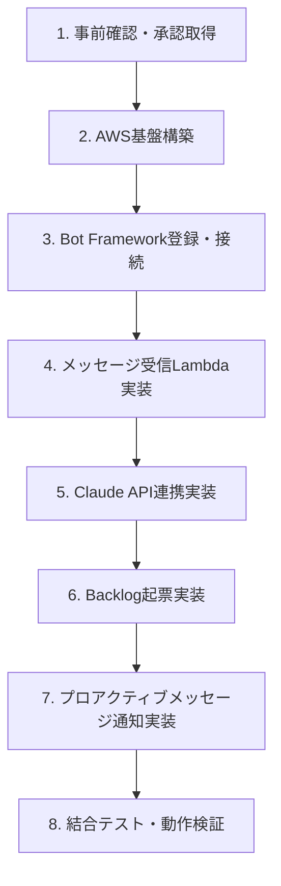

# フェーズ1 ワークフロー

## 事前準備・確認事項

### Teams（会社資産のため要確認）

| 項目 | 内容 | 確認先 |
|---|---|---|
| Azure ADアプリ登録 | Teams Botを動かすにはAzure ADにアプリ登録が必要（Bot Framework） | IT管理部門 |
| カスタムアプリの配布許可 | TeamsにBotアプリをインストールするにはTeams管理センターでの許可が必要 | IT管理部門 / M365管理者 |
| 送受信データの取り扱い | メッセージ内容を外部API（Claude API）に送信する点のセキュリティ確認 | 情報セキュリティ部門 |
| 対象チャネルの範囲 | 全チャネルか、特定チャネルのみに限定するか | PO / チームリーダー |

### AWS

| 項目 | 内容 |
|---|---|
| AWSアカウント | Lambda, API Gatewayが利用可能なアカウントを用意 |
| API Gateway | Bot FrameworkからのメッセージをLambdaにルーティング |
| SSM Parameter Store | APIキー・プロジェクト設定の管理 |

### 外部サービス

| 項目 | 内容 |
|---|---|
| Claude API Key | Anthropic APIキーの取得 |
| Backlog API Key | 対象プロジェクトへの起票権限があるAPIキーの取得 |
| Backlogカスタムステータス | 「AI下書き」ステータスの追加（project_setup APIで自動作成） |

## 開発ステップ

| ステップ | 内容 | ブランチ |
|---|---|---|
| 1. 事前確認 | Teams管理者への申請、APIキー取得 | - |
| 2. AWS基盤構築 | Lambda + API Gateway + SSM + SQS のセットアップ | `feature/○○/infra` |
| 3. Bot Framework登録 | Azure AD アプリ登録、Azure Bot作成、エンドポイント設定 | `feature/○○/teams-webhook` |
| 4. メッセージ受信 | Bot FrameworkからのActivityを受け取りJWT検証するLambda | `feature/○○/teams-webhook` |
| 5. Claude API連携 | メッセージをClaude APIに送り意図判定・課題内容を生成 | `feature/○○/task-create` |
| 6. Backlog起票 | Claude APIの結果をもとに「AI下書き」ステータスで課題作成 | `feature/○○/task-create` |
| 7. 結果通知 | Bot Frameworkプロアクティブメッセージで元チャネルに結果を投稿 | `feature/○○/teams-webhook` |
| 8. 結合テスト | E2Eでの動作検証（テスト用チャネルで実施） | `develop` |
